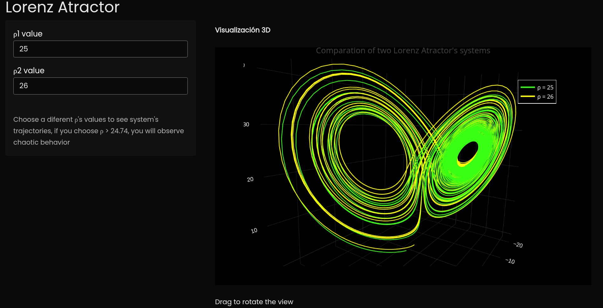
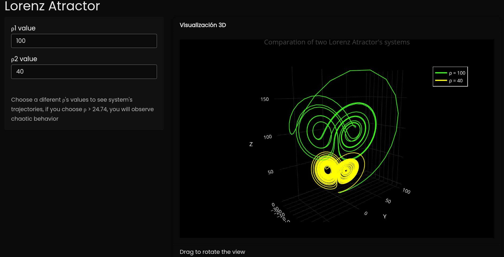

# LorenzAtractor_R

This is an interactive visualization of the Lorenz attractor. Here you can choose two values of $\rho$ and compare the orbits of the system for each value.

## How to use it?
You just need to download [app.R](app.R) and run it from [RStudio](https://rstudio--education-github-io.translate.goog/hopr/starting.html?_x_tr_sl=en&_x_tr_tl=es&_x_tr_hl=es&_x_tr_pto=tc)

## Visualization
Here are some screenshots of the interface:

Here you have just two pictures: a system with values $\rho_1 = 25$ and $\rho_2 = 26$ (top) and a system with values $\rho_1 = 100$ and $\rho_2 = 40$ (bottom).

